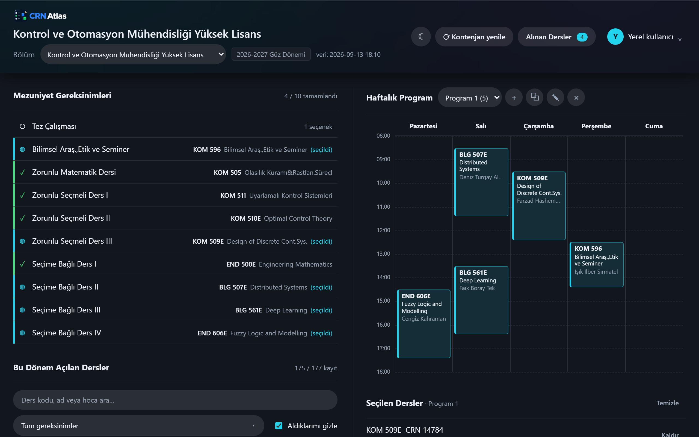
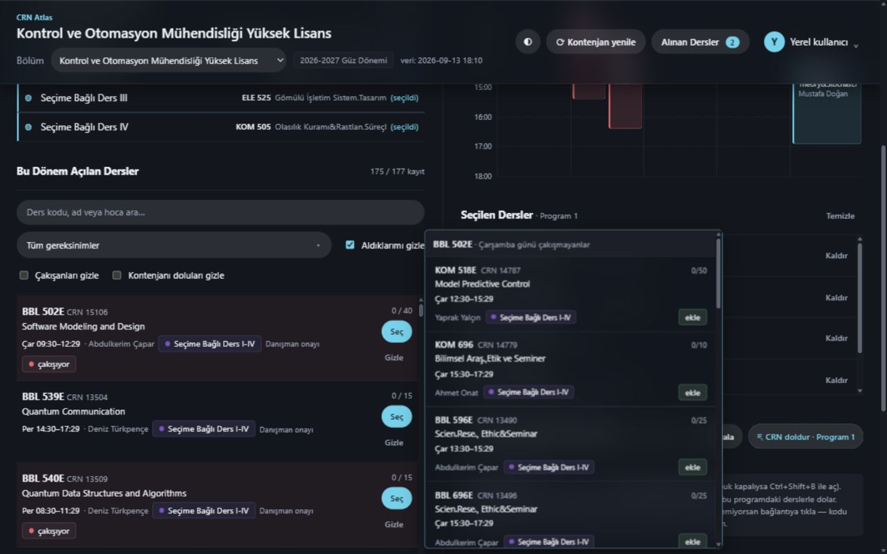
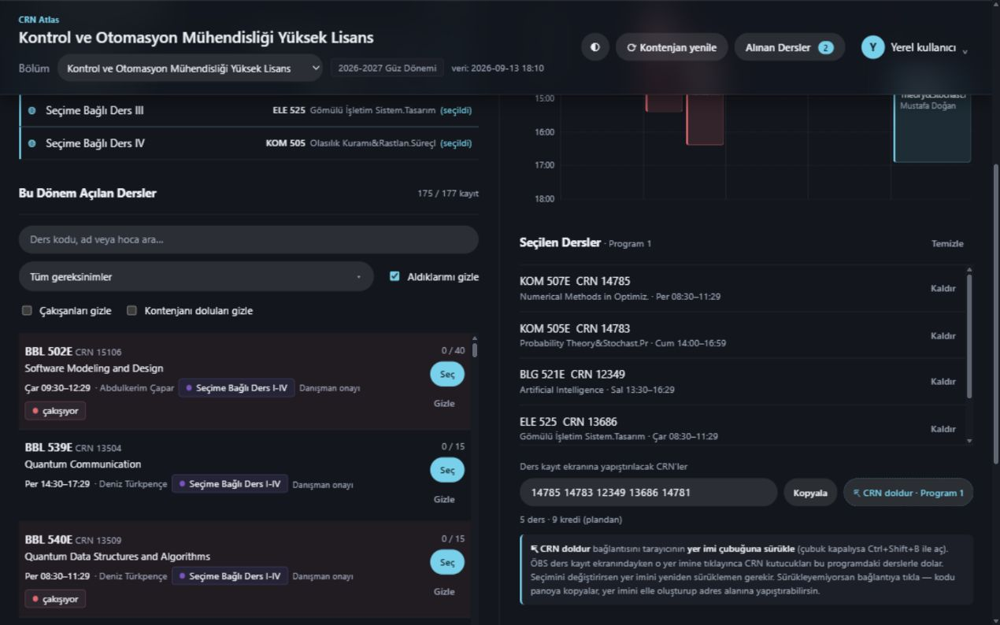
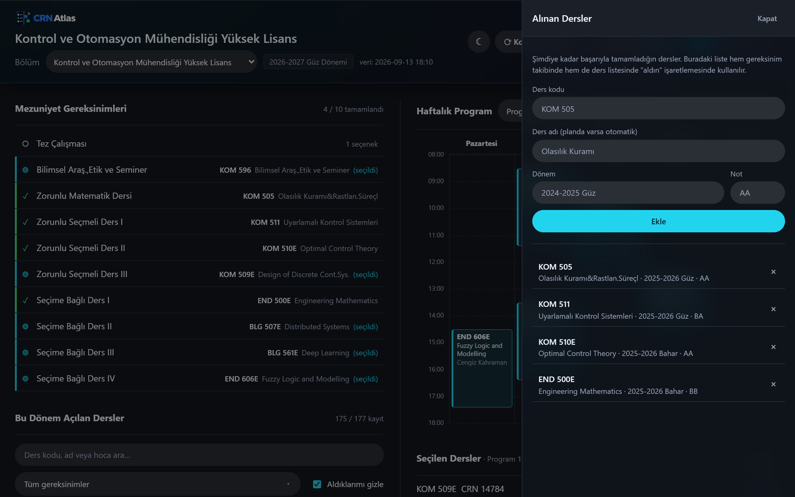

# CRN Atlas

İTÜ öğrencileri için ders planı, haftalık program ve CRN listesi tek yerde.
CRN Atlas, ÖBS'de **gerçekten açılan** dersleri programının gereksinimleriyle
eşleştirir; dersleri karşılaştırmanı, çakışmaları görmeni ve kayıt için CRN
listeni hazırlamanı sağlar.

**Kurulum yok.** Canlı sürüm tarayıcıda çalışır. Şu an desteklenen yüksek lisans
programları: **Kontrol ve Otomasyon Mühendisliği**, **Uzay Mühendisliği**,
**Çevre Bilimleri Mühendisliği ve Yönetimi**. Seçimlerin, aldığın dersler ve
gizlediklerin hesabına kaydedilir; başka bir cihazdan girdiğinde de yerinde durur.

👉 **[muhal1.github.io/crn-atlas](https://muhal1.github.io/crn-atlas/)**

> ⚠️ **Resmî bir İTÜ uygulaması değildir.** İstanbul Teknik Üniversitesi ile
> bağlantısı yoktur, üniversite tarafından desteklenmez. Yalnızca ÖBS'nin
> herkese açık sayfalarındaki veriyi okur. Kontenjan, önşart ve mezuniyet
> gereksinimlerinde **resmî kaynak her zaman ÖBS'dir**; ders kaydını da ÖBS
> üzerinden sen yaparsın.



Görseller, kişisel hesap yerine örnek ders verileriyle çekilmiştir.

---

## 🚀 Nasıl kullanılır

1. **[muhal1.github.io/crn-atlas](https://muhal1.github.io/crn-atlas/)** adresine git.
2. E-posta ile hesap aç — ücretsiz, saniyeler sürer, doğrulama e-postası dışında bir şey istemez.
3. Desteklenen yüksek lisans programlarından bölümünü seç.
4. Panel senin planına sayan dersleri kendisi bulur. Ders seçtikçe haftalık
   programın kurulur, çakışmalar kırmızı görünür.
5. Altta hazır duran CRN listesini kopyala, ÖBS ders kayıt ekranına yapıştır.

Kaydı panel yapmaz — CRN listesini üretir, kaydı ÖBS üzerinden sen yaparsın.

<br>

> 💡 **Zaten aldığın dersleri girmek zorunda değilsin.** Sağ üstteki
> **"Alınan Dersler"** düğmesinden istediğin zaman ekleyip silebilirsin; hem
> gereksinim takibinde hem "bu dersi aldın" işaretinde kullanılır.

---

## Panelde neler var

**Mezuniyet gereksinimleri** — Planındaki her slot (Zorunlu Matematik Dersi,
Zorunlu Seçmeli I/II/III, Seçime Bağlı I–IV, Tez …) ayrı bir satır. Alınan
derslerin bu slotlara otomatik eşlenir: `✓` tamamlanmış, `◍` bu dönem seçtiğin
dersle dolacak, `○` hâlâ boş.

**Bu dönem açılan dersler** — Sadece planına sayan dersler listelenir. Her satırda
CRN, öğretim üyesi, gün/saat, kontenjan (`yazılan / kontenjan`) ve dersin hangi
gereksinimlere sayıldığı görünür. Süzgeçler: arama, gereksinim, *aldıklarımı
gizle*, *çakışanları gizle*, *kontenjanı doluları gizle*.



**Aynı gün önerisi** — Ders listesinde bir dersin üstüne fareyi getirince yandan
bir kutu açılır: o dersle **aynı gün** olan ama **saati çakışmayan** dersleri
listeler. "Salı zaten kampüstesin, o gün başka ne alabilirsin" sorusunun cevabı.
Kutudaki bir derse tıklayınca doğrudan aktif programına eklenir; tekrar
tıklayınca çıkar. Seçimindeki başka bir dersle çakışan adaylar kırmızı kenarla
ve "seçiminle çakışır" etiketiyle işaretlenir (yine de eklenebilirler).

**Haftalık program** — Seçtiğin dersler saat saat yerleşir. Üst üste binen iki
ders kırmızıya döner ve başlıkta "Çakışma var" uyarısı çıkar.

**Program profilleri** — "Haftalık Program" yazısının yanındaki açılır listeden
birden çok alternatif program tutabilirsin ("Program 1", "Plan B" …). Yanındaki
düğmeler: `+` yeni boş program, `⧉` bu programın kopyası (bir varyantı
denemenin en hızlı yolu), `✎` adını değiştir, `×` sil. Listede her programın
kaç ders içerdiği görünür. Profiller arasında geçtiğinde ders listesi, haftalık
program ve CRN kutusu o profile göre yenilenir. Profillerin hesabına kaydedilir.

**Seçilen dersler + CRN** — Seçimin altında ders kayıt ekranına yapıştırılacak
CRN listesi hazır durur, "Kopyala" ile panoya alırsın. Aynı dersin başka bir
şubesine tıklarsan eskisinin yerine geçer.

**⇱ CRN doldur (yer imi)** — CRN kutusunun yanındaki kesik çizgili bağlantıyı
tarayıcının yer imi çubuğuna sürükle. ÖBS ders kayıt ekranındayken o yer imine
tıklayınca CRN kutucukları seçtiğin derslerle sırayla dolar (kutucuklara tek tek
yazmana gerek kalmaz). Bağlantı içinde CRN'ler gömülü olduğu için **seçimini
değiştirirsen yer imini yeniden sürüklemelisin**. Yer iminin adı aktif programın
adını taşır ("⇱ CRN doldur · Program 1"), böylece her alternatif program için
ayrı bir yer imi tutabilirsin. Sürükleyemiyorsan bağlantıya tıkla: kodu panoya
kopyalar, yer imini elle oluşturup adres alanına yapıştırabilirsin.



**Alınan Dersler (yan panel)** — Sağ üstteki düğmeyle açılır. Şimdiye kadar
tamamladığın dersleri buraya eklersin; hem gereksinim takibinde hem de ders
listesinde "bu dersi aldın" işaretinde kullanılır. Ders kodunu yazınca adı
plandan otomatik dolar.



**⟳ Kontenjan yenile** — Kontenjanlar kayıt haftası boyunca hızla dolar. Sağ
üstteki bu düğme açılan dersleri ve kontenjanları ÖBS'den yeniden çeker; genelde
bir saniyeden kısa sürer. Panel kendiliğinden ÖBS'ye bağlanmaz, veri yalnızca bu
düğmeye bastığında tazelenir. Üst şeritteki "veri: …" yazısı elindeki verinin ne
zaman çekildiğini gösterir.

---

## Sadece seni ilgilendiren dersler nasıl seçiliyor

Kritik nokta bu: ÖBS'de binlerce ders var, panelde yalnızca ~10–40 tane olmalı.

```
ders planı (planId)
   └─ her gereksinim slotu bir "grupId"e bağlı
        └─ grup içindeki ders kodları     ->  KOM 501E, ELE 514, MKM 596 …
                                               │
                        bu kodlardan branşlar ─┤  KOM, ELE, MKM
                                               ▼
            sadece bu branşların dönemlik ders programı indirilir
                                               │
                       plandaki kodlara göre süzülür
                                               ▼
                                     veri/dersler.json
```

Yani panelin veri tabanı, planının kendisi tarafından belirlenir. Planında
olmayan bir branşın dersleri hiç indirilmez.

**Serbest seçmeli istisnası:** "Seçime Bağlı Ders" slotlarının ÖBS'de ders
listesi yoktur (seviyeye uygun her kredili ders sayılır). Bu slotlar için her
programa ayrıca bir branş listesi tanımlanır; o branşlardan gelen dersler panelde
`Seçime Bağlı Ders I-IV` rozetiyle görünür. Listede görmek istediğin bir branş
eksikse [issue aç](../../issues/new), eklensin.

---

## Veri kaynağı

Tümü `obs.itu.edu.tr` üzerindeki herkese açık sayfalar; giriş gerektirmez.

| Amaç | Uç nokta |
|---|---|
| Ders planı | `/public/DersPlan/DersPlanDetay/{planId}` |
| Bir slota sayan dersler | `/public/DersPlan/_DersGrupSearch?grupId={grupId}` |
| Program listesi (planId bulma) | `/public/DersPlan/GetAkademikProgramByBirimIdAndPlanTipi` |
| Plan sürümleri | `/public/DersPlan/DersPlanlariList` |
| Aktif dönem | `/public/DersProgram/GetAktifDonemByProgramSeviye` |
| Branş kodları | `/public/DersProgram/SearchBransKoduByProgramSeviye` |
| Açılan dersler (CRN) | `/public/DersProgram/DersProgramSearch` |

Bunlar resmî bir API değil, sayfaların kendi kullandığı uçlardır. ÖBS arayüzünü
değiştirirse ayrıştırma bozulabilir; o durumda düzeltilecek yer `obs_client.py`
içindeki tablo ayrıştırma fonksiyonlarıdır ve `veri/ham/` klasöründeki
snapshot'lar karşılaştırma için oradadır.

---

## Notlar ve sınırlar

* Panel kayıt **yapmaz**; CRN listesini üretir, kaydı sen ÖBS'de yaparsın.
* Proje resmî bir İTÜ uygulaması değildir ve üniversiteyle bağlantısı yoktur.
* Kontenjan ve "yazılan" sayıları çekildiği andaki değerlerdir, canlı değildir.
* Gereksinim eşlemesi açgözlü (greedy) bir eşlemedir: önce listesi belli
  slotlar, sonra serbest seçmeliler doldurulur. Danışman onayı, önşart ve
  kredi üst sınırı gibi kuralları **kontrol etmez** — resmî kaynak ÖBS'dir.

---

## Katkı ve lisans

Katkıya açık — hata bildirimi, özellik önerisi ve pull request hepsi olur.
Projenin birkaç bilinçli tercihi var: bağımlılığa gerek olmadıkça eklenmez,
adlandırma Türkçedir, kaydı panel yapmaz.

* 🐛 Bir şey bozulduysa [issue aç](../../issues/new)
* 🔒 Güvenlik sorununu herkese açık issue yerine
  [özel bildirimle](../../security/advisories/new) gönder

ÖBS arayüzü değiştiğinde ayrıştırma kırılabilir; **en değerli katkı bu tür hata
bildirimleridir.** Bildirirken bölümünü ve hangi derste ne gördüğünü yazman
yeterli.

Koda dokunacaksan depoyu klonlayıp [`AGENTS.md`](AGENTS.md) dosyasındaki
adımları izle; paneli kendi bilgisayarında çalıştırmak için gereken her şey
orada.

[MIT lisansı](LICENSE) ile dağıtılır. Kısaca: kullanabilir, değiştirebilir,
kendi bölümüne uyarlayıp paylaşabilirsin; tek şart telif notunu korumak.
